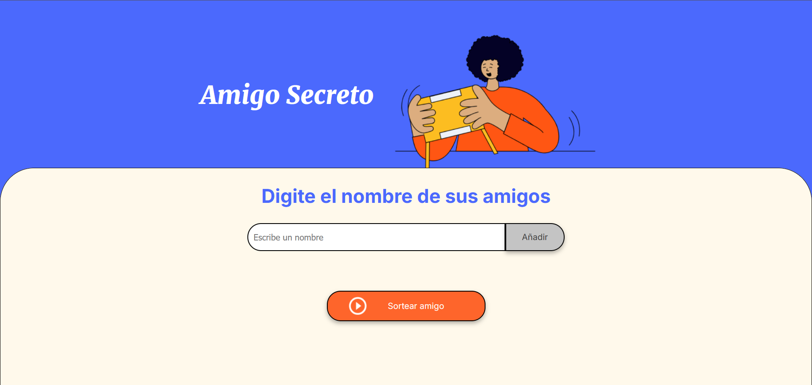

<h1 align="center">Challenge 1</h1>

El amigo secreto 🤫</h3>

    
    

    

Este es la solución al _Challenge_ de la formación de **lógica de programación**, del programa [Oracle One Next Education](https://www.oracle.com/ar/education/oracle-next-education/).

Este reto consiste en crear la lógica detrás de una aplicación para elegir un amigo secreto de una tanda de amigos.

> [!NOTE]
> La resolución se da en el archivo `app.js`

# 🎯 Objetivos

- [x] 💼 **Crear un array para almacenar los nombres**
- [x] 😗 **Función para agregar amigos**
  - [x] Capturar el valor del campo de entrada
  - [x] Validar la entrada
  - [x] Actualizar el array de amigos
  - [x] Limpiar el campo de entrada
- [x] 🔃 **Función para actualizar la lista de amigos**
  - [x] Obtener el elemento de la lista
  - [x] Limpiar la lista existente
  - [x] Iterar sobre el arreglo
  - [x] Agregar elementos a la lista
- [ ] 🎲 **Función para sortear los amigos**
  - [ ] Validar que haya amigos disponibles
  - [ ] Generar un índice aleatorio
  - [ ] Obtener el nombre sorteado
  - [ ] Mostrar el resultado
