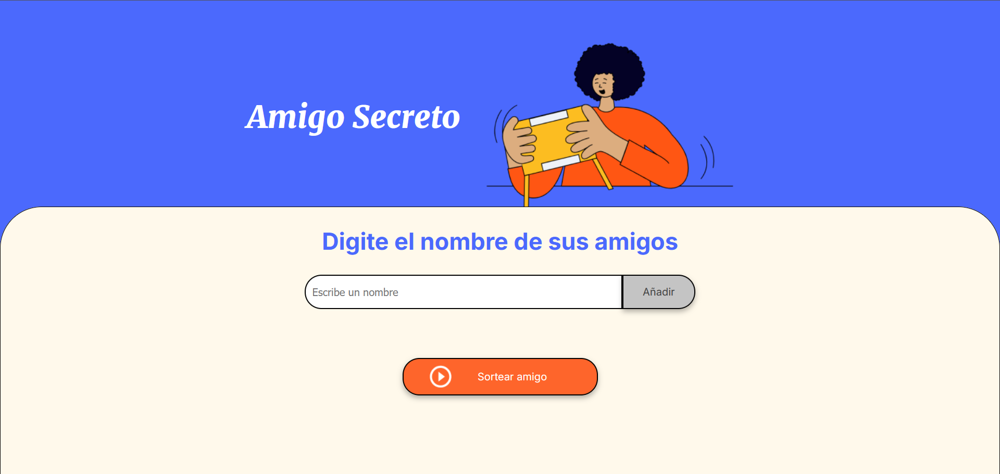
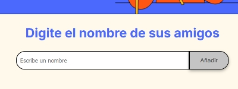
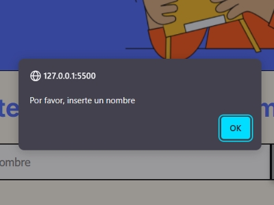
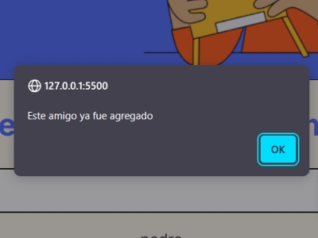
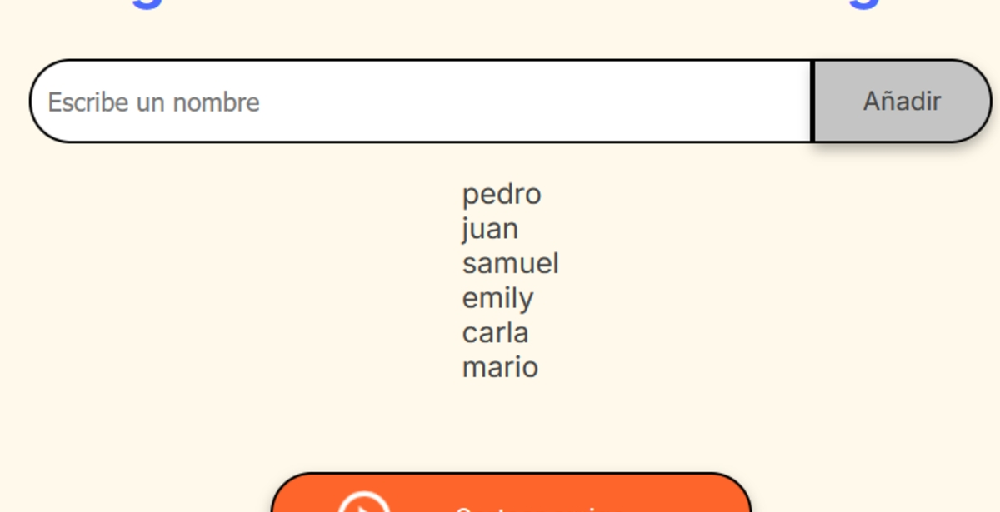
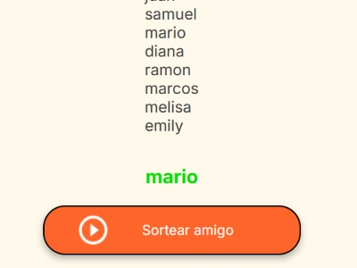
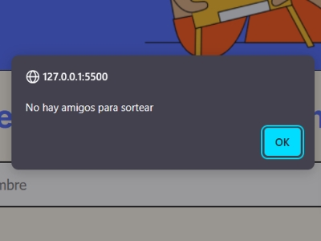

<h1 align="center">Challenge 1</h1>

El amigo secreto 🤫</h3>

    
    

    

Este es la solución al _Challenge_ de la formación de **lógica de programación**, del programa [Oracle One Next Education](https://www.oracle.com/ar/education/oracle-next-education/).

Este reto consiste en crear la lógica detrás de una aplicación para elegir un amigo secreto de una tanda de amigos.

> [!NOTE]
> La resolución se da en el archivo `app.js`

# 🎯 Objetivos

- [x] 💼 **Crear un array para almacenar los nombres**
- [x] 😗 **Función para agregar amigos**
  - [x] Capturar el valor del campo de entrada
  - [x] Validar la entrada
  - [x] Actualizar el array de amigos
  - [x] Limpiar el campo de entrada
- [x] 🔃 **Función para actualizar la lista de amigos**
  - [x] Obtener el elemento de la lista
  - [x] Limpiar la lista existente
  - [x] Iterar sobre el arreglo
  - [x] Agregar elementos a la lista
- [x] 🎲 **Función para sortear los amigos**
  - [x] Validar que haya amigos disponibles
  - [x] Generar un índice aleatorio
  - [x] Obtener el nombre sorteado
  - [x] Mostrar el resultado

# ✨ Funcionalidades

En esta sección se describirá todas las funcionalidades que posee el proyecto.

> 
> Ejemplo de uso del proyecto

## ➕ Agregar amigos

Mediante un `input` de tipo texto el usuario puede ingresar un texto que representa el nombre de un amigo.

Con el botón "_Añadir_" se agrega el valor de la
entrada a un lista.

  

La entrada de datos posee un sistema de validación para verificar si la entrada **está vacía o ya está agregada en la lista**.

<table align='center'>
  <tr>
    <td>
      
      <h3 align="center">
        Entrada vacía
      </h3>
    </td>
    <td>
      
      <h3 align="center">
        Entrada repetida
      </h3>
    </td>
  </tr>
</table>

## 📄 Lista de amigos

**Cada vez que se agrega un nuevo nombre** se actualiza un sector de la página para mostrar el estado de la lista.

  

## 🎉 Sorteo de amigo

Una vez que el usuario haya terminado de agregar los nombres, puede oprimir el botón de "`Sortear Amigo`" para obtener un elemento de la lista al azar.

<table align="center">
  <tr>
    <td>
      
      <h3 align="center">Resultado</h3>
    </td>
    <td>
      
      <h3 align="center">Lista vacía</h3>
    </td>
  </tr>
</table>
